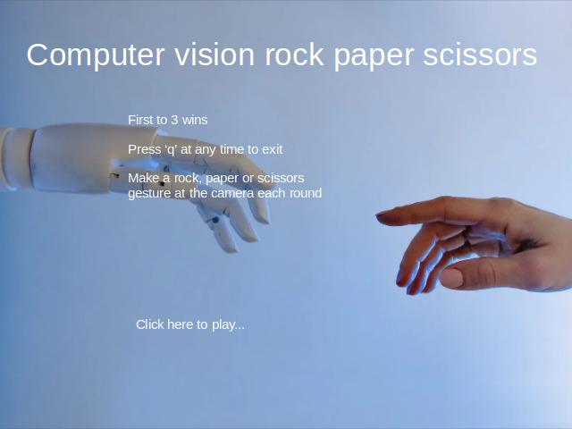
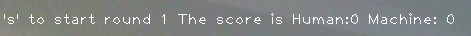

# Computer Vision Rock Paper Scissors
Rock, paper scissors game where player uses hand gestures to play versus the computer.
Uses python (with cv2, keras, numpy, time and random modules).

## Milestone 1: Coded logic of rock, paper, scissors game
Put together a simple rock paper scissors game object with which a human player can play rock paper scissors against the computer.
   
    `import random
    class rpsgame:

        def __init__(self):
            rpsgame.choices = ['rock','paper','scissors']
            rpsgame.dicrps = {'rock': 'paper', 'paper': 'scissors', 'scissors': 'rock'}
            rpsgame.humscore = 0
            rpsgame.aiscore = 0
            rpsgame.text = (f"Human: {rpsgame.humscore} Machine: {rpsgame.humscore}")

            

        def rpsround(self):
            aichoice = random.choice(rpsgame.choices)
            #print(aichoice)
            
            humchoice = rpsgame.choices[int(input("0 for rock, 1 for paper, 2 for scissors"))]
            if humchoice == aichoice:
                print("draw")
            elif humchoice == rpsgame.dicrps.get(aichoice):
                rpsgame.humscore += 1
            else:
                rpsgame.aiscore += 1

            print(rpsgame.humscore, rpsgame.aiscore)

        def play(self):
            while rpsgame.humscore < 5 and rpsgame.aiscore < 5:
                self.rpsround(self)
            print(f'Human got {rpsgame.humscore}, AI got {rpsgame.aiscore}')

    def start():
            game = rpsgame()
            rpsgame.play(rpsgame)

    if __name__ == '__main__':
        start()`

## Milestone 2: Trained computer vision model
Using the teachable machines standard image model tool ([teachable machines](https://teachablemachine.withgoogle.com/train/image)), I trained a model to recognise a rock, paper or scissors hand gesture as well as a null input.

This code was used to interact with the model, to produce an opencv window and predict what the hand gesture the player is making:
    
    `import cv2
    from keras.models import load_model
    import numpy as np
    import time
    model = load_model('/home/oliver/Documents/rock paper/ComputerVisionRockPaperScissors/ComputerVisionRockPaperScissors/keras_model.h5')
    cap = cv2.VideoCapture(0)
    data = np.ndarray(shape=(1, 224, 224, 3), dtype=np.float32)

    while True: 
        ret, frame = cap.read()
        resized_frame = cv2.resize(frame, (224, 224), interpolation = cv2.INTER_AREA)
        image_np = np.array(resized_frame)
        normalized_image = (image_np.astype(np.float32) / 127.0) - 1 # Normalize the image
        data[0] = normalized_image
        prediction = model.predict(data)
        cv2.imshow('frame', frame)
        # Press q to close the window
        print(prediction)
        if cv2.waitKey(1) & 0xFF == ord('q'):
            break
            
    # After the loop release the cap object
    cap.release()
    # Destroy all the windows
    cv2.destroyAllWindows()`

## Milestone 3: Integrated Milestones 1 & 2
The two scripts were combined, the model's most likely result replaced the keyboard input used in milestone 1.

## Milestone 4 Features added to create a user-friendly application
Through hand gestures, keyboard and mouse input, the player can navigate the game and play to a best of 3 against the computer.
The player is first greeted with a landing page indicating how to use the program:

The player is then lead by text instructions which are presented at the top of the screen:

